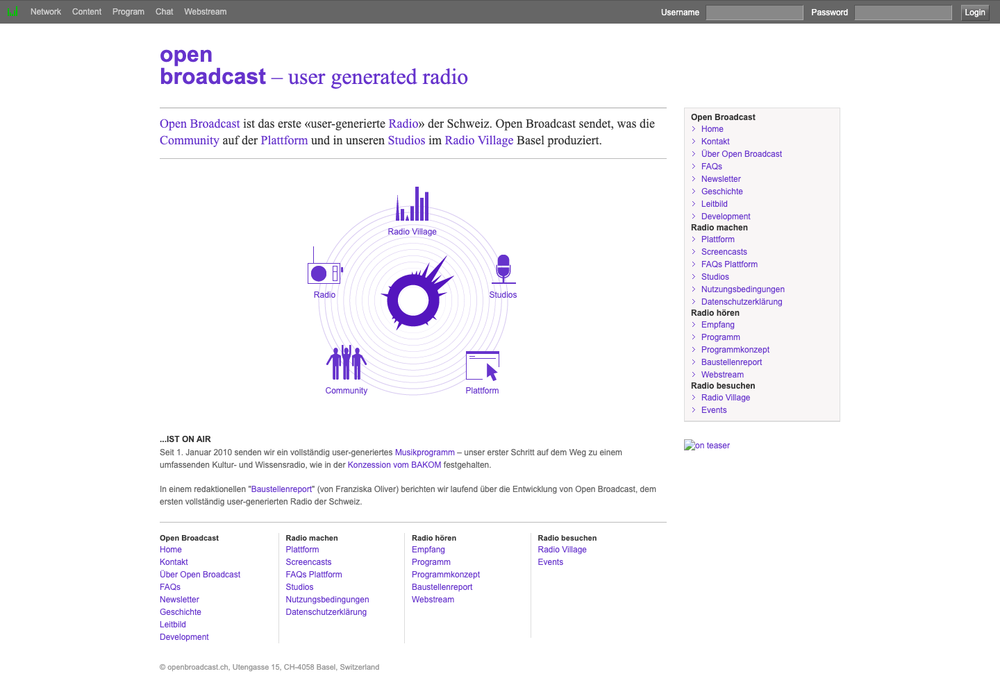
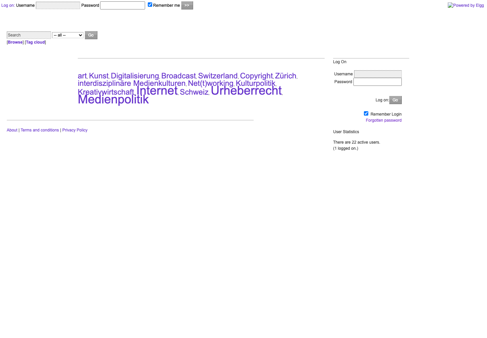
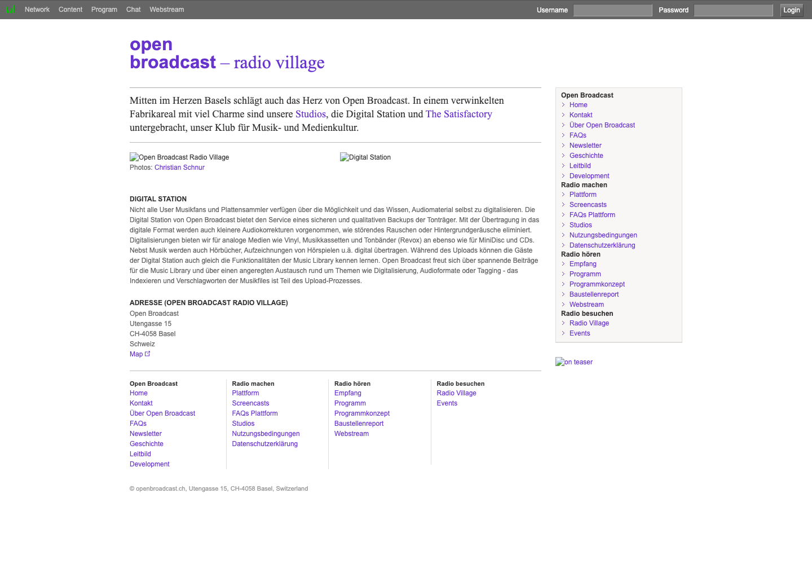
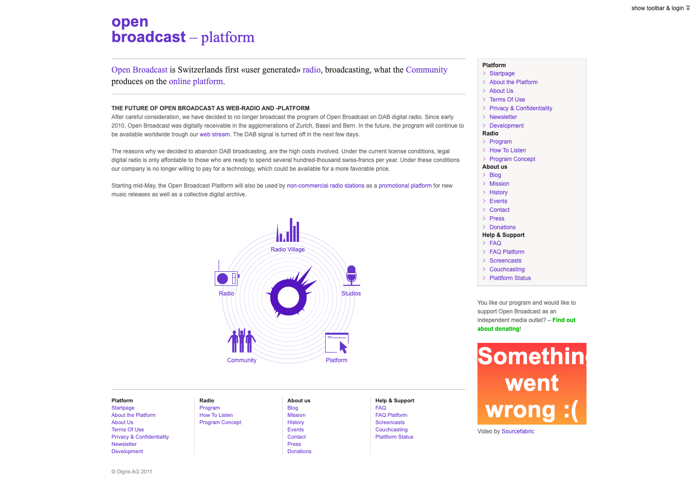
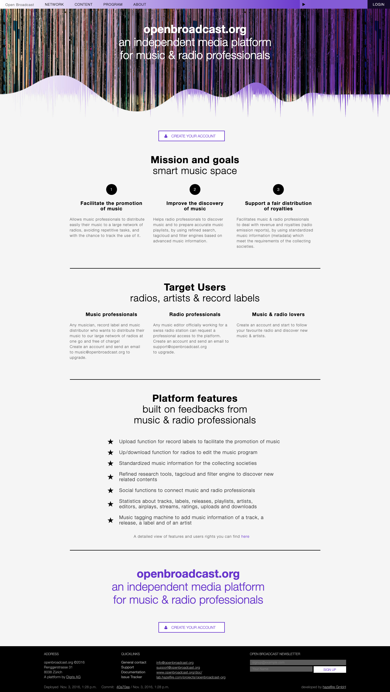
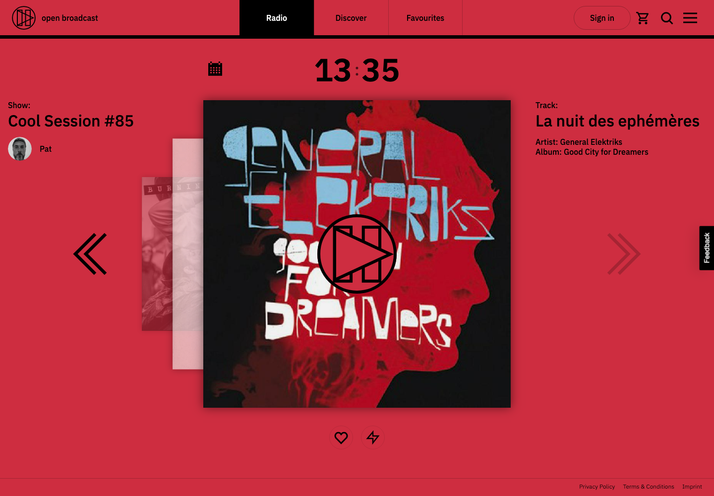

# The History of Open Broadcast

Open Broadcast began as an attempt to build something considerably larger: a public, non-commercial internet platform on which musicians, DJs, sound engineers, journalists, scientists, artists and institutions would jointly produce a radio station, a shared music archive, and an editorial culture — all governed by the same open-source, invitation-based community, and anchored in a real physical clubhouse in Basel. Large parts of that platform were actually designed and built. Most of it did not survive. What remains today — a small editorial team producing music playlists and schedules for one station — is not the mature end point of that original plan. It is the fragment that was left after most of the plan was tried and set aside.

This document reconstructs that arc: where the project came from, what it tried to become, what happened to that attempt, and what survived.

## Origins: a radio concession in search of software

Open Broadcast's origin story does not start with a business plan for a radio platform. It starts with a club night. In February 2006, a one-month radio project called *swissAIR* accompanied the closing party of Zurich's Dachkantine, at the time a well-known club and cultural venue, with a series of live DJ broadcasts. The event drew enough interest that Thomas Gilgen, a co-founder of Dachkantine, began developing the idea of a radio programme that an online community could produce from home, rather than from a conventional newsroom or studio. Gilgen refined the concept together with Georg Hasler, described in the project's own account of its history as "a subversive Basel businessman, programmer and author."

The idea then acquired a legal anchor. In June 2006, the Swiss federal department responsible for communications made eight DAB+ radio channels available, and on 19 July 2006 Gilgen was granted a broadcasting concession for German-speaking Switzerland with a mandate for "educational content, cultural topics and underground music," explicitly encouraged to expand "traditional radio formats through experimental, multimedia productions" using DAB+'s data capabilities.

At that point Open Broadcast had a licence but no way to fulfil it: no software existed that would let a distributed community produce a radio programme collaboratively over the web. Building that software — "the Open Broadcast platform" — became the actual founding project. Open Broadcast was established in 2007 as a Basel-based, non-commercial, non-profit stock corporation ("gemeinnützige Aktiengesellschaft"), funded through foundation grants rather than advertising or subscriptions, with its address at Utengasse 15 — a former factory site in Basel that the project called **Radio Village**.

## The platform as the point, the radio as one output of it

From the earliest formal statements of intent, the "platform" — not the radio station — is presented as the primary thing being built. The 2010 mission statement ("Leitbild") states the vision plainly: *"Open Broadcast creates the public place where the media production of the future takes place."* The radio station is downstream of that: *"The Open Broadcast Community produces a high-standard arts-and-science radio (user-generated content)"* on top of the platform, not the other way around.

The same document lays out a strategy considerably larger than running one station. Universities, art galleries, museums, media companies and event organisers were to be integrated into the platform through "three-way co-operations, pooling, collaboration or merger." The platform itself was to be given to other media providers free of charge. And, notably, the strategy states that Digris — the company that had built and operated the platform — intended to legally separate from Open Broadcast over the long term, so that the platform could stand as an independent, shared piece of media infrastructure rather than one company's product.

The 2010 homepage visualised this as a single system with five equally weighted parts, arranged in a ring around the platform's own icon:

*openbroadcast.ch, June 2010. The five-part diagram — Radio, Studios, Community, Platform, Radio Village — is the clearest visual statement of how the project understood its own scope: broadcasting, physical space, and an online community as three faces of a single production system, with "Platform" as the hub connecting them.*

Before any of this, the same domain hosted something much smaller and less radio-shaped. In 2008, openbroadcast.ch was a bare Elgg social-networking install — login box, a tag cloud, "People" and "Communities" browse links — used by a circle of around 20-25 registered users to blog about topics like *Kunst* (art), *Kulturpolitik* (culture policy), *Kreativwirtschaft* (creative economy) and *Urheberrecht* (copyright):

*openbroadcast.ch, July 2008. Before there was a radio station, there was a small discussion community built on Elgg, an open-source social-networking platform, oriented around media and cultural-policy topics such as copyright ("Urheberrecht") and digitisation. The radio station and its production tooling were built on top of this substrate over the following two years.*

Between that community site and the system described below, the project imagined something briefly even larger than a single station. In early 2009, before Open Broadcast had broadcast a single note, its homepage described itself as a **"Content Network"**: "every web-radio or web-TV project" would get its own "media workshop" with its own channel on the platform, discoverable by other projects through shared tagging, with scientific and cultural actors invited to "link up" with media-makers and jointly produce content across what the page called "an independent editorial network" — many channels, not one. By that autumn the plan had already narrowed to something concrete and singular: one Open Broadcast channel, test-broadcasting a "Baustellenreport" (work-in-progress report, presented by Franziska Oliver) from 15 November 2009, ahead of a fully user-generated music programme that went to air on 1 January 2010. The multi-channel Content Network was never built; everything that follows describes what was built instead, for that one channel.

## What was actually built (2008-2011)

By 2010-2011, a great deal of the ambitious vision above had gone from statement of intent to working system.

**Roles and community structure.** Open Broadcast's community was not an undifferentiated audience; it had a formal, documented role system. "Autoren" (Authors) produced content — spoken segments, playlists, DJ sets, live sets, recordings of concerts — and could hold profile-qualification categories including Lyricist, Radio DJ, Audio Designer, Audio Technician, Sound Engineer, Narrator, Radio Announcer/Host, Correspondent, Multimedia Producer, Software Developer, Archive Administrator, Music Producer, Musician, Artist, Actor, Event Organiser, Institution, and Mediator. "Programmverantwortliche" (Editors) — recruited from among Editors, Dramaturges, Directors, and Media Lawyers — held additional "media-competency rights": checking submitted material for quality before it aired, flagging under-represented topics to the author community, moderating disputes, and ensuring the station's actual output matched its legal broadcasting mandate. An "Admin" committee of Open Broadcast staff sat above both, with the right to delete content and suspend users, editors or producers, and was described as the body responsible for guarding the platform's philosophy and enforcing its social rules.

Membership was invitation-only: each user could invite five more, and the inviting member acted as a "mentor," responsible for vetting the new member's stated profile and role. The platform's own FAQ was explicit about why: *"Open Broadcast strives primarily for 'user-generated quality,' not 'user-generated quantity.'"* Growing the community as fast as possible was, by design, not the goal.

Layered on top of this was a full **journalistic code of conduct**, adapted from the guidelines of the Swiss Press Council (presserat.ch) and published on the platform: truth-seeking as the basis of all reporting, freedom of information, pluralism of opinion, separation of fact from comment, incompatibility of journalism with holding public office, rules governing exclusive contracts and confidential sources, labelling of archive material, a right of reply before publishing serious allegations, a ban on concealing one's profession while gathering information, conditions under which undercover research and leaked information could be published, rules for authorising interviews, and duties around correction, privacy, non-discrimination and independence from sponsors. This is not a lightweight community-guidelines page; it is a professional-grade editorial ethics document, applied to a project run largely by volunteers.

**Programming and scheduling.** The Program Concept laid out a full weekly grid of named dayparts, each specified by mood, music style and word content, aiming for an overall word-to-music ratio of 30/70 as required by the broadcasting concession. "Early Bird" (06:00-07:00) was a wordless soundscape of dawn ambience; "Mikro" (09:00-12:00) played only instrumental music so spoken science and arts content had room to breathe; "Politur" (12:00-13:00) mixed news with "Agit pop, polit hiphop"; "Autour du Monde" (16:00-17:00) was world music; "Box & Live" (20:00-23:00) carried live sets and label showcases broadcast from The Satisfactory; "Ozean" (23:00-24:00) closed the day with ambient mixes, explicitly referencing David Toop's *Ocean of Sound*; "Nuits Sauvages" ran overnight as unrestricted underground programming. This was conceived as a curated cultural and scientific magazine format, not a jukebox.

A purpose-built **Scheduler** turned this concept into daily operations: a day/week/month grid onto which Authors booked playlists, DJ sets and live sets, each carrying a title, creator, short abstract, tags and exact timing, with a named "Editor in chief" assigned to each day — the interface visibly flagged when a day had none.

**A real music library.** Every uploaded track or release was automatically tagged with metadata — release, artist, label — explicitly so the resulting dataset could double as the reporting data required by copyright collecting societies. By April 2010 the shared "Music Library" already held roughly 55,000 titles from more than 6,000 artists and 2,000 labels, organised into over 400 playlists, and growing daily.

**Physical space.** The platform's online community had a real-world counterpart. Radio Village, housed in a rambling former factory site ("ein verwinkeltes Fabrikareal mit viel Charme") in the heart of Basel, contained the production Studios, a public **Digital Station**, and **The Satisfactory** — described as "our club for music and media culture." The Digital Station offered visitors a free digitisation service for vinyl, cassettes, reel tape, MiniDiscs and CDs — cleaning up noise along the way — while simultaneously depositing the digitised material into the shared Music Library and teaching visitors to tag and index it. Community members could also meet project staff in person at monthly open sessions ("Fahrstunden") held in Basel and Zurich.

*The "Radio Village" page, 2010. Radio Village was a real, addressable location (Utengasse 15, Basel) housing the Studios, the Digital Station, and The Satisfactory club — physical infrastructure that tied the platform's online community directly to a place people could visit, digitise their record collections, and socialise.*

**Decentralised production.** "Couchcasting" let any community member broadcast live from home, a club, or a concert directly into the DAB+/webstream signal, using consumer DJ software, free open-source streaming tools, or dedicated hardware encoders — a concrete mechanism for decentralising production beyond the physical studio.

**Technical partnerships and outside recognition.** The community layer ran on Elgg; radio-specific modules (music archive, playlist editor, scheduler) were built on top of it; and the scheduler linked to Campcaster, an open-source radio-playout system built by Campware, a collaboration the project described as "deepened by the founding of Sourcefabric" — Campware's successor organisation, which Open Broadcast said it shared "the principle aims of independent media" with. Open Broadcast drew outsized attention for its size: panels and presentations at the International Radio Festival Zurich, Clubtransmediale Berlin ("Change of Use — The Evolution of Online Music Services"), m4music, Shift Festival Basel, c/o pop Cologne, and a European Broadcasting Union "Ars Acustica" meeting in Hvar, Croatia; press coverage from Swiss trade outlets, Deutschlandradio, Austria's Ö1, and a live broadcast from Radio Village by WFMU (New York) host Ken Freedman; and its own festival, "OBEX — Open Broadcast Exchange," held at Radio Village in 2009 and 2010.

## 2011: the DAB signal goes silent, the platform pivots

The most developed moment of this system was also the moment it ruptured. In February 2011, the Swiss regulator BAKOM ordered Open Broadcast's DAB signal reinstated after it had been switched off — Swiss media described the episode as "a precedent case." Then, within months, Open Broadcast made its own decision to stop DAB broadcasting entirely. The project's own homepage explained why in a section headed **"The Future of Open Broadcast as Web-Radio and -Platform"**: legal digital radio broadcasting cost several hundred thousand Swiss francs a year under the licence terms then in force, and the company was "no longer willing to pay for a technology, which could be available for a more favorable price." The DAB signal was switched off; the programme would continue only over the web stream.

*openbroadcast.ch, mid-2011. The same Radio/Studios/Community/Platform/Radio Village diagram from 2010 is still on the homepage, but the surrounding text announces the abandonment of DAB broadcasting on cost grounds, and a reorientation toward the platform serving other stations.*

The same page announced what came next: starting mid-2011, the Open Broadcast Platform would also be offered to other non-commercial radio stations as "a promotional platform for new music releases as well as a collective digital archive" — a shift the trade press covered directly as the "Bemusterungsplattform" (promo-servicing platform) being expanded. The registered address moved from Radio Village in Basel to Flüelastrasse 47 in Zurich. The formal Mission Statement was translated into English and kept largely intact — but the station whose licence had originally justified building all of this no longer had a terrestrial signal.

For roughly two years afterward, the public-facing openbroadcast.ch site barely changed. A capture from December 2013 shows essentially the same "good news about DAB expansion" homepage as 2011, its copyright footer still reading "© Digris AG 2012" — a site left largely as-is through a fallow stretch between the 2011 pivot and the next visible relaunch.

## Professionalisation: openbroadcast.org (2014-2016)

What re-emerged was narrower, and explicitly said so. A related domain, openbroadcast.org, presented itself as **"an independent media platform for music & radio professionals"** — tagline: **"smart music space."** Its stated mission had shrunk to three concrete, industry-facing goals: facilitate the promotion of music (labels and artists distributing releases to a network of radios), improve the discovery of music (radio editors building playlists via search, tagcloud and filter tools), and support a fair distribution of royalties (standardised metadata meeting collecting-society requirements).

*openbroadcast.org, November 2016. The community-and-culture framing of 2010-2011 is gone. What remains is explicitly industry infrastructure: promotion, discovery, and royalty metadata for three defined groups of professional users — no journalism, no physical venue, no science-radio ambition.*

Target users were now three narrow categories: "Music professionals" (musicians, labels, distributors), "Radio professionals" ("any music editor officially working for a Swiss radio station"), and "Music & radio lovers" — a residual public tier that could only follow stations and discover music, with no path to production. Access to real functionality required an explicit application for a "Radio-PRO" or "Music-PRO" account, replacing the earlier informal invite-and-mentor system with a gatekept professional accreditation model; a banner on the platform's release library told ordinary visitors plainly: *"The Open Broadcast Platform is targeting a professional audience. To unleash its full potential you will have to login with a 'Radio-PRO' or 'Music-PRO' account."*

The one part of the original ambition that had, by this point, unambiguously succeeded on its own terms was the music library. A snapshot from December 2014 recorded 14,733 releases, 14,537 artists, 108,144 tracks and 4,783 labels, with a tagcloud spanning hundreds of genres, scenes and festivals — evidence that whatever else had not worked, the shared, tagged music archive had grown into large, genuinely useful infrastructure, now serving a wider network of partner radios rather than one station.

Meanwhile, the word "editor" survived, but its meaning had narrowed with everything else: from a "Programmverantwortlicher" charged with quality-checking a whole community magazine-format station's output against its legal broadcasting mandate (2010), to "any music editor officially working for a Swiss radio station" logging in to arrange a playlist (2016) — a title carried forward, its civic and journalistic content emptied out.

## What survived, and what disappeared

Set side by side, the trajectory is one of subtraction, not growth. The Community role hierarchy, the invite-and-mentor system, the Admin philosophy-guardianship, the Swiss-Press-Council-derived journalistic code of conduct, Radio Village and its Studios, the Digital Station, The Satisfactory club, the public "Fahrstunden" meetups, Couchcasting, the OBEX festival, and the "culture-and-science radio" programming concept with its named, mood-scored dayparts — none of these are present in the 2014-2016 professional platform, and none of them are present in the system in use today. They do not reappear in a simplified form elsewhere; they simply stop appearing.

What does survive is narrow and consistent. As early as October 2009, before the station had even gone on air, the platform's own sidebar navigation, under a "Browse" heading, already listed three specific modules: **Music Library**, **Playlists**, and (once the scheduling tool matured) **Scheduler**. Those three nouns are, essentially verbatim, the entirety of the project's current self-description: "Music library, playlist management, and broadcast scheduling platform." Everything else that once sat alongside them in the site's navigation over the following years — Network, Content, Chat, Contacts, Groups, Broadcasts, Events, Press, Donations — is gone.

## Present day

Today, openbroadcast.ch presents a single, minimal radio player: a "Radio / Discover / Favourites" navigation, a now-playing widget showing the current show, host, track and album, and little else at the surface. There is no public community directory, no events calendar, no venue, no journalistic guidelines document, and no visible role taxonomy beyond a short "Discover → editors" list of current playlist curators — the last visible trace of what was once a formally structured, multi-tier production community.

*openbroadcast.ch, 2026. Radio, Discover, Favourites — a single station, a now-playing widget, and little else visible at the surface. What was once presented as five interlocking domains (Radio, Studios, Community, Platform, Radio Village) has narrowed to one.*

Operationally, the platform is used daily by a small radio editorial team to build music playlists and schedules for one station, running on ageing infrastructure that the project's own technical notes describe candidly as overdue for attention. That present-day reality is not a smaller version of the original plan executed well; it is what was left standing after a considerably larger plan — spanning journalism, science and culture programming, a physical clubhouse, decentralised live production, and an open, self-governing community of contributing professionals — was tried, and did not, for the most part, last.

## Sources

Primary sources for this document are archived captures of openbroadcast.ch and openbroadcast.org held locally under [`docs/history/archive-org/`](archive-org/), listed with their original Wayback Machine URLs in [`archive-org/README.md`](archive-org/README.md). Several additional captures referenced in that table were not preserved locally and were retrieved directly from the Wayback Machine for this document:

- [Press](https://web.archive.org/web/20111031132521/http://blog.openbroadcast.ch/de/aboutus/press/) (2011) — the project's own list of press mentions, 2009-2011
- [Couchcasting](https://web.archive.org/web/20111129151111/http://blog.openbroadcast.ch/support/couchcasting/) (2011)
- [Contacts / Community](https://web.archive.org/web/20110918163406/http://www.openbroadcast.ch/mod/browser/contacts/&display=&param=adf&extra=) (2011)
- [openbroadcast.ch homepage](https://web.archive.org/web/20131221232412/http://www.openbroadcast.ch/de) (December 2013)
- [openbroadcast.ch homepage](https://web.archive.org/web/20160401090503/https://www.openbroadcast.ch/) (April 2016)

External context on Digris AG and its broader DAB+ infrastructure work, distinct from the Open Broadcast content platform itself, comes from [Digris AG's own project page](https://www.digris.ch/uber-digris/projekte/) and [TagesWoche, "Die kleine Radiorevolution auf DAB"](https://tageswoche.ch/gesellschaft/die-kleine-radiorevolution-auf-dab/).
